# Task Orchestrator Architecture Diagrams

Visual diagrams showing how Task Orchestrator solves AI agent reliability problems.

---

## 1. The Problem: Why 95% of AI Agents Fail

```mermaid
flowchart TD
    subgraph FAILURE["❌ THE FAILURE CASCADE"]
        A[User Request] --> B[Agent Loop]
        B --> C{API Call}
        C -->|Timeout| D[Error Response]
        D --> E[Agent Interprets Error]
        E -->|Hallucination| F[Retry with Bad Params]
        F --> C

        style D fill:#ff6b6b,color:#fff
        style E fill:#ff6b6b,color:#fff
        style F fill:#ff6b6b,color:#fff
    end

    subgraph COST["💸 COST EXPLOSION"]
        F --> G[Loop Iteration #1]
        G --> H[Loop Iteration #100]
        H --> I[Loop Iteration #4000]
        I --> J["$4,500 Bill 💀"]

        style J fill:#ff0000,color:#fff,stroke-width:3px
    end

    subgraph BLIND["🔍 NO VISIBILITY"]
        K[Logs Show] --> L["'I decided to search for apple pie recipes'"]
        L --> M[Why? Unknown]
        M --> N[Debugging by Guessing]

        style N fill:#666,color:#fff
    end
```



---

## 2. The Solution: Self-Healing Architecture

```mermaid
flowchart TD
    subgraph INPUT["📥 REQUEST"]
        A[User Request]
    end

    subgraph ORCHESTRATOR["🛡️ TASK ORCHESTRATOR"]
        B[Budget Guard<br/>$0.50 limit]
        C[Circuit Breaker<br/>3 failures = block]
        D[Retry Policy<br/>Exponential Backoff]
        E[Immune System<br/>Pattern Detection]
    end

    subgraph AGENT["🤖 AGENT EXECUTION"]
        F[Architect Agent]
        G[Builder Agent]
        H[QC Agent]
    end

    subgraph OUTPUT["✅ RESULT"]
        I[Validated Output]
        J[Cost Report]
        K[Learned Patterns]
    end

    A --> B
    B --> C
    C --> D
    D --> E
    E --> F
    F --> G
    G --> H
    H --> I
    H --> J
    H --> K

    style B fill:#4CAF50,color:#fff
    style C fill:#2196F3,color:#fff
    style D fill:#9C27B0,color:#fff
    style E fill:#FF9800,color:#fff
```



---

## 3. Circuit Breaker State Machine

```mermaid
stateDiagram-v2
    [*] --> CLOSED: System Start

    CLOSED --> CLOSED: Success ✓
    CLOSED --> OPEN: 3 Failures ✗✗✗

    OPEN --> HALF_OPEN: 30s Timeout

    HALF_OPEN --> CLOSED: Test Success ✓
    HALF_OPEN --> OPEN: Test Failure ✗

    note right of CLOSED
        Normal operation
        All requests pass through
    end note

    note right of OPEN
        Tool blocked
        Fast-fail responses
        Agent finds alternative
    end note

    note right of HALF_OPEN
        Testing recovery
        Single request allowed
    end note
```



---

## 4. The Immune System: Learning from Failure


---

## 5. Agent Archetypes Workflow


---

## 6. Cost Management Flow


---

## 7. Federation: Cross-Project Learning


---

## 8. Before vs After: The Transformation

```mermaid
flowchart LR
    subgraph BEFORE["❌ BEFORE: Fragile Agent"]
        A1[while True loop]
        A2[No error handling]
        A3[No budget limits]
        A4[Blind debugging]
        A5[Isolated learning]

        A1 --> A2 --> A3 --> A4 --> A5
    end

    subgraph AFTER["✅ AFTER: Resilient Agent"]
        B1[Bounded iterations]
        B2[Circuit breakers]
        B3[Hard cost limits]
        B4[Full observability]
        B5[Federated learning]

        B1 --> B2 --> B3 --> B4 --> B5
    end

    BEFORE -->|"Task Orchestrator"| AFTER

    style A1 fill:#ff6b6b,color:#fff
    style A2 fill:#ff6b6b,color:#fff
    style A3 fill:#ff6b6b,color:#fff
    style A4 fill:#ff6b6b,color:#fff
    style A5 fill:#ff6b6b,color:#fff

    style B1 fill:#4CAF50,color:#fff
    style B2 fill:#4CAF50,color:#fff
    style B3 fill:#4CAF50,color:#fff
    style B4 fill:#4CAF50,color:#fff
    style B5 fill:#4CAF50,color:#fff
```



---

## 9. Complete System Overview

```mermaid
flowchart TB
    subgraph USER["👤 USER LAYER"]
        U1[Claude Code]
        U2[MCP Client]
        U3[API]
    end

    subgraph ORCHESTRATION["🎯 ORCHESTRATION LAYER"]
        O1[Task Router]
        O2[Archetype Selector]
        O3[Priority Queue]
    end

    subgraph SAFETY["🛡️ SAFETY LAYER"]
        S1[Budget Guard]
        S2[Circuit Breaker]
        S3[Rate Limiter]
        S4[Immune System]
    end

    subgraph EXECUTION["⚙️ EXECUTION LAYER"]
        E1[🏗️ Architect]
        E2[👷 Builder]
        E3[✅ QC]
        E4[🔍 Researcher]
    end

    subgraph TOOLS["🔧 44 MCP TOOLS"]
        T1[spawn_agent]
        T2[cost_summary]
        T3[immune_status]
        T4[federation_sync]
        T5[... +40 more]
    end

    subgraph PERSISTENCE["💾 PERSISTENCE LAYER"]
        P1[(Graphiti<br/>Knowledge Graph)]
        P2[(Langfuse<br/>Observability)]
        P3[(Pattern Store<br/>Federation)]
    end

    U1 & U2 & U3 --> O1
    O1 --> O2
    O2 --> O3
    O3 --> S1
    S1 --> S2
    S2 --> S3
    S3 --> S4
    S4 --> E1 & E2 & E3 & E4
    E1 & E2 & E3 & E4 --> T1 & T2 & T3 & T4 & T5
    T1 & T2 & T3 & T4 & T5 --> P1 & P2 & P3

    style S1 fill:#4CAF50,color:#fff
    style S2 fill:#2196F3,color:#fff
    style S3 fill:#9C27B0,color:#fff
    style S4 fill:#FF9800,color:#fff
```



---

## 10. The 6 Pillars Visualization


---

## Usage

These diagrams can be rendered in:
- **GitHub README** - Native Mermaid support
- **Notion** - Via Mermaid code blocks
- **VS Code** - Mermaid Preview extension
- **Web** - mermaid.live for PNG/SVG export
- **Demo Video** - Export as animated SVGs

### Export for Video

```bash
# Install mermaid-cli
npm install -g @mermaid-js/mermaid-cli

# Export to PNG
mmdc -i architecture-diagrams.md -o diagram.png

# Export to SVG (better for animation)
mmdc -i architecture-diagrams.md -o diagram.svg -t dark
```

### Recommended for Demo Video

1. **Opening (0:00-0:20)**: Use Diagram #1 (Failure Cascade) - animate the red boxes
2. **Solution (0:20-0:45)**: Use Diagram #2 (Self-Healing Architecture)
3. **Magic Moment (1:15-1:45)**: Use Diagram #3 (Circuit Breaker State Machine) - animate state transitions
4. **Immune System**: Use Diagram #4 - show pattern learning flow
5. **Archetypes (2:15-2:45)**: Use Diagram #5 - highlight each archetype
6. **Closing**: Use Diagram #9 (Complete System Overview)
