# Task Orchestrator Sequence Diagrams

Dynamic flow diagrams showing real-time system behavior.

---

## 1. Self-Healing in Action: The Recovery Flow

```mermaid
sequenceDiagram
    autonumber
    participant U as 👤 User
    participant O as 🎯 Orchestrator
    participant CB as 🔒 Circuit Breaker
    participant A as 🤖 Agent
    participant T as 🔧 External Tool
    participant IM as 🧬 Immune System

    U->>O: Execute complex task
    O->>CB: Check circuit state
    CB-->>O: CLOSED ✓

    O->>A: Spawn Builder agent
    A->>T: Call search API

    Note over T: ⚠️ API Timeout!

    T--xA: Error: 504 Gateway Timeout
    A->>CB: Report failure #1
    CB-->>A: Circuit still CLOSED

    A->>T: Retry with backoff (2s)
    T--xA: Error: 504 Gateway Timeout
    A->>CB: Report failure #2

    A->>T: Retry with backoff (4s)
    T--xA: Error: 504 Gateway Timeout
    A->>CB: Report failure #3

    Note over CB: 🚨 CIRCUIT OPENS!

    CB->>IM: Analyze failure pattern
    IM-->>CB: Pattern: "search_api_timeout"
    IM->>A: Inject corrective prompt

    Note over A: 💡 Uses alternative tool

    A->>T: Call cached_search instead
    T-->>A: Success! Results returned

    A-->>O: Task completed
    O-->>U: ✅ Result delivered

    Note over CB: 30s later: HALF_OPEN
    Note over CB: Test success: CLOSED
```

---

## 2. Cost Management: Budget Enforcement

```mermaid
sequenceDiagram
    autonumber
    participant U as 👤 User
    participant BG as 💰 Budget Guard
    participant A as 🤖 Agent
    participant LLM as 🧠 LLM API
    participant AL as 🔔 Alert System

    U->>BG: Task with $5.00 budget
    BG->>BG: Initialize tracker

    loop Each Agent Step
        A->>BG: Request LLM call
        BG->>BG: Check remaining budget

        alt Budget OK
            BG-->>A: Approved ✓
            A->>LLM: Generate response
            LLM-->>A: Response (1,200 tokens)
            A->>BG: Report: $0.12 spent
            BG->>BG: Update: $4.88 remaining
        else Budget Low (< 20%)
            BG->>AL: Warning: Budget at 18%
            AL-->>U: ⚠️ Budget alert
            BG-->>A: Approved (with warning)
        else Budget Exceeded
            BG->>AL: CRITICAL: Budget exceeded
            AL-->>U: 🚨 Budget limit reached
            BG--xA: REJECTED - Budget exceeded
            A-->>U: Task paused gracefully
        end
    end

    Note over BG: Final report generated
    BG-->>U: 📊 Cost report: $4.95 / $5.00
```

---

## 3. Multi-Agent Workflow: Architect → Builder → QC

```mermaid
sequenceDiagram
    autonumber
    participant U as 👤 User
    participant O as 🎯 Orchestrator
    participant AR as 🏗️ Architect
    participant BU as 👷 Builder
    participant QC as ✅ QC
    participant RE as 🔍 Researcher

    U->>O: "Add user authentication"

    Note over O: Phase 1: Research & Design

    O->>RE: Gather context
    RE->>RE: Search codebase
    RE->>RE: Find auth patterns
    RE-->>O: Context report

    O->>AR: Design authentication system
    AR->>AR: Analyze requirements
    AR->>AR: Consider trade-offs
    AR-->>O: Design spec + test plan

    Note over O: Phase 2: Implementation

    O->>BU: Implement from spec
    BU->>BU: Write failing tests (RED)
    BU->>BU: Implement code (GREEN)
    BU->>BU: Refactor (REFACTOR)
    BU-->>O: Implementation complete

    Note over O: Phase 3: Validation

    O->>QC: Validate implementation
    QC->>QC: Run test suite
    QC->>QC: Security audit
    QC->>QC: Performance check

    alt All Checks Pass
        QC-->>O: ✅ Approved
        O-->>U: Feature complete!
    else Issues Found
        QC-->>O: ❌ Issues found
        O->>BU: Fix issues
        BU-->>O: Fixed
        O->>QC: Re-validate
        QC-->>O: ✅ Approved
        O-->>U: Feature complete!
    end
```

---

## 4. Federation: Cross-Project Pattern Sharing

```mermaid
sequenceDiagram
    autonumber
    participant PA as 📦 Project A
    participant IM as 🧬 Immune System
    participant FH as 🌐 Federation Hub
    participant PB as 📦 Project B
    participant PC as 📦 Project C

    Note over PA: Discovers new failure pattern

    PA->>IM: Tool X fails with error Y
    IM->>IM: Analyze pattern
    IM->>IM: Create corrective strategy
    IM-->>PA: Pattern learned locally

    PA->>FH: Push pattern to federation
    FH->>FH: Validate pattern
    FH->>FH: Add to shared store

    Note over FH: Pattern available globally

    par Sync to Project B
        FH->>PB: Sync new patterns
        PB->>PB: Merge into local store
    and Sync to Project C
        FH->>PC: Sync new patterns
        PC->>PC: Merge into local store
    end

    Note over PB: Later: Encounters same issue

    PB->>IM: Tool X fails with error Y
    IM->>IM: Check pattern store
    IM-->>PB: 💡 Known pattern! Apply fix

    Note over PB: Instant recovery!<br/>No learning delay
```

---

## 5. Langfuse Observability: Full Trace

```mermaid
sequenceDiagram
    autonumber
    participant U as 👤 User
    participant O as 🎯 Orchestrator
    participant A as 🤖 Agent
    participant LF as 📊 Langfuse
    participant DB as 💾 Dashboard

    U->>O: Complex task request

    O->>LF: Create trace (trace_id: abc123)
    Note over LF: Trace started

    O->>A: Spawn agent
    A->>LF: Create span: "agent_execution"

    loop Each LLM Call
        A->>LF: Create generation span
        A->>A: Execute LLM call
        A->>LF: Log tokens, cost, latency
        LF->>LF: Calculate metrics
    end

    A->>LF: Close agent span
    A-->>O: Agent complete

    O->>LF: Add score: quality=0.92
    O->>LF: Add score: cost=$0.34
    O->>LF: Close trace

    LF->>DB: Push metrics
    DB->>DB: Update dashboards

    U->>DB: View trace details
    DB-->>U: 📈 Full execution breakdown

    Note over DB: See every decision,<br/>every token,<br/>every cost
```

---

## 6. The Complete Request Lifecycle

```mermaid
sequenceDiagram
    autonumber
    participant U as 👤 User
    participant MCP as 🔌 MCP Server
    participant RT as 🎯 Router
    participant BG as 💰 Budget
    participant CB as 🔒 Circuit
    participant IM as 🧬 Immune
    participant AG as 🤖 Agents
    participant LF as 📊 Langfuse
    participant FD as 🌐 Federation

    rect rgb(50, 50, 80)
        Note over U,MCP: 1. REQUEST INTAKE
        U->>MCP: spawn_archetype_agent(builder, task)
        MCP->>RT: Route request
    end

    rect rgb(50, 80, 50)
        Note over RT,IM: 2. SAFETY CHECKS
        RT->>BG: Check budget
        BG-->>RT: ✓ Budget OK
        RT->>CB: Check circuits
        CB-->>RT: ✓ All CLOSED
        RT->>IM: Check patterns
        IM-->>RT: 💡 2 relevant patterns
    end

    rect rgb(80, 50, 50)
        Note over AG,LF: 3. EXECUTION
        RT->>AG: Execute with patterns
        AG->>LF: Start trace
        AG->>AG: Process task
        AG->>LF: Log progress
    end

    rect rgb(80, 80, 50)
        Note over AG,FD: 4. LEARNING
        AG->>IM: Report outcomes
        IM->>FD: Share new patterns
    end

    rect rgb(50, 80, 80)
        Note over MCP,U: 5. RESPONSE
        AG-->>MCP: Result + metrics
        MCP-->>U: ✅ Task complete
    end
```

---

## 7. Error Recovery Comparison: Before vs After

```mermaid
sequenceDiagram
    participant U as 👤 User
    participant OLD as ❌ Old Agent
    participant NEW as ✅ Task Orchestrator

    rect rgb(100, 50, 50)
        Note over U,OLD: WITHOUT TASK ORCHESTRATOR
        U->>OLD: Complex task
        OLD->>OLD: API call fails
        OLD->>OLD: Retry #1 (immediate)
        OLD->>OLD: Retry #2 (immediate)
        OLD->>OLD: Retry #3 (immediate)
        OLD->>OLD: ... (infinite loop)
        Note over OLD: 💸 $4,500 later...
        OLD--xU: ❌ Crashed / Budget blown
    end

    rect rgb(50, 100, 50)
        Note over U,NEW: WITH TASK ORCHESTRATOR
        U->>NEW: Complex task
        NEW->>NEW: API call fails
        NEW->>NEW: Retry #1 (2s backoff)
        NEW->>NEW: Retry #2 (4s backoff)
        NEW->>NEW: Retry #3 (8s backoff)
        Note over NEW: 🔒 Circuit opens
        NEW->>NEW: Switch to backup tool
        NEW-->>U: ✅ Task complete ($0.34)
    end
```

---

## Rendering Tips

### For Video Animation

Use tools like:
- **Mermaid Live Editor** (mermaid.live) - Export as SVG
- **D2** (d2lang.com) - Better animations
- **Motion Canvas** - Programmatic animation from Mermaid

### Recommended Animation Sequence

1. **Diagram 7** (Before/After) - Side-by-side comparison, powerful opener
2. **Diagram 1** (Self-Healing Flow) - Show the recovery in action
3. **Diagram 2** (Cost Management) - Budget protection visualization
4. **Diagram 3** (Multi-Agent) - Archetype workflow
5. **Diagram 4** (Federation) - Cross-project learning

### Color Coding Convention

| Color | Meaning |
|-------|---------|
| 🟢 Green | Success / Safety |
| 🔴 Red | Failure / Danger |
| 🔵 Blue | Information / Action |
| 🟡 Yellow | Warning / Caution |
| 🟣 Purple | Learning / Intelligence |
| 🟠 Orange | Alert / Attention |
